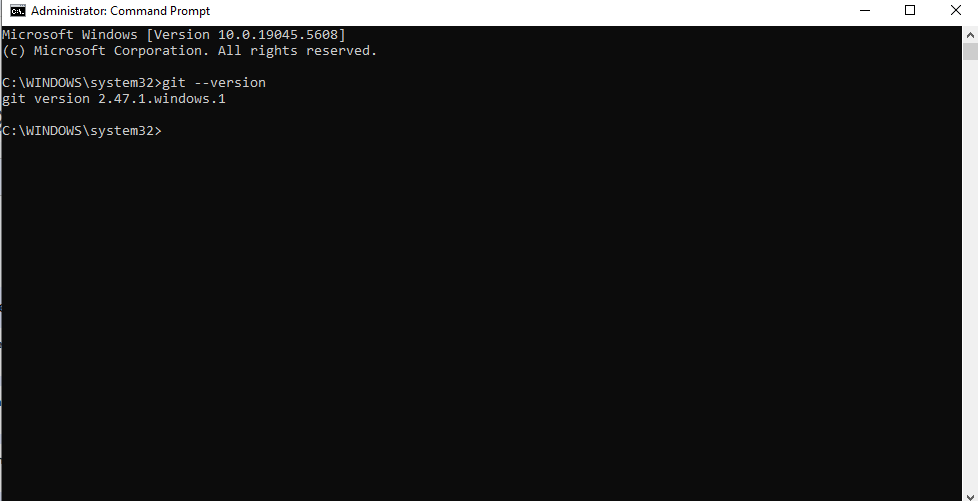

# Tech Environment Setup 

## Tools Installed :
- Visual Studio Code.

- Git.

- VirtualBox.

- Ubuntu on VirtualBox.

## Accounts Created :
- GitHub Account.

- Amazon Web Services (AWS) Account.

## Setup Guide:
1. Installed Git and configured it with user details.
2. Installed VS Code and used it for this project.
3. Installed VirtualBox and set up an Ubuntu virtual machine.
4. Created a GitHub and AWS account.

